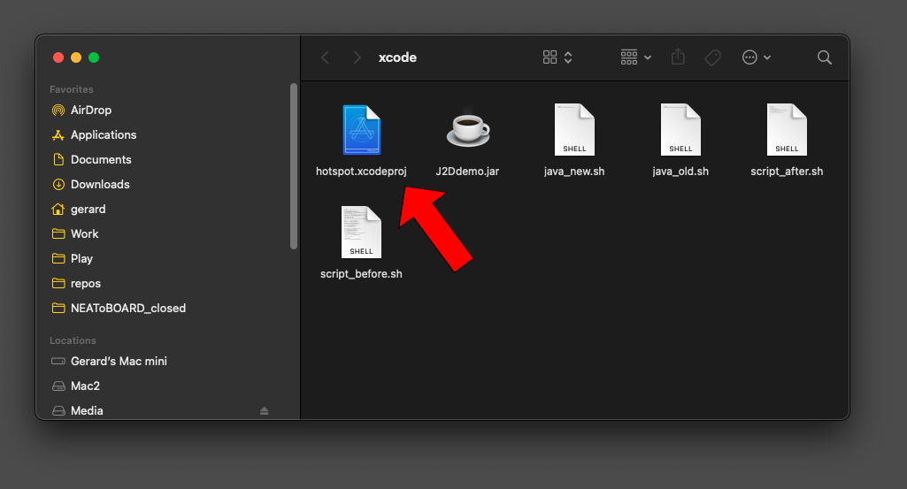
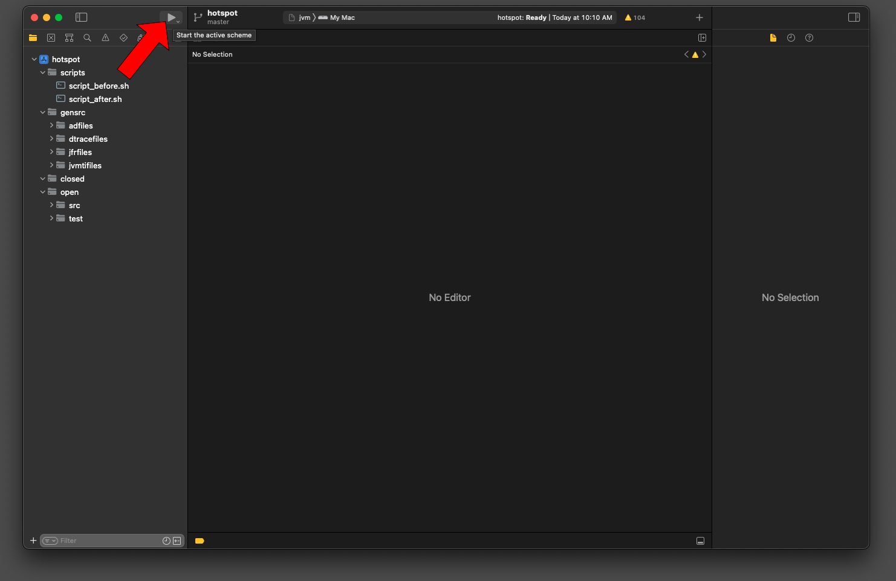
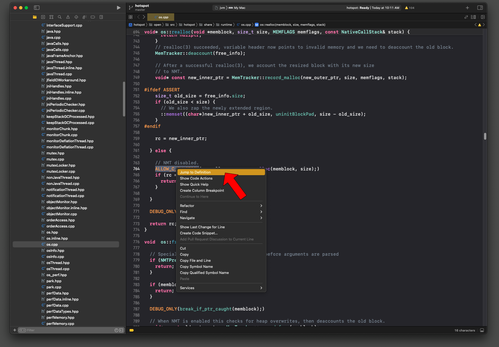
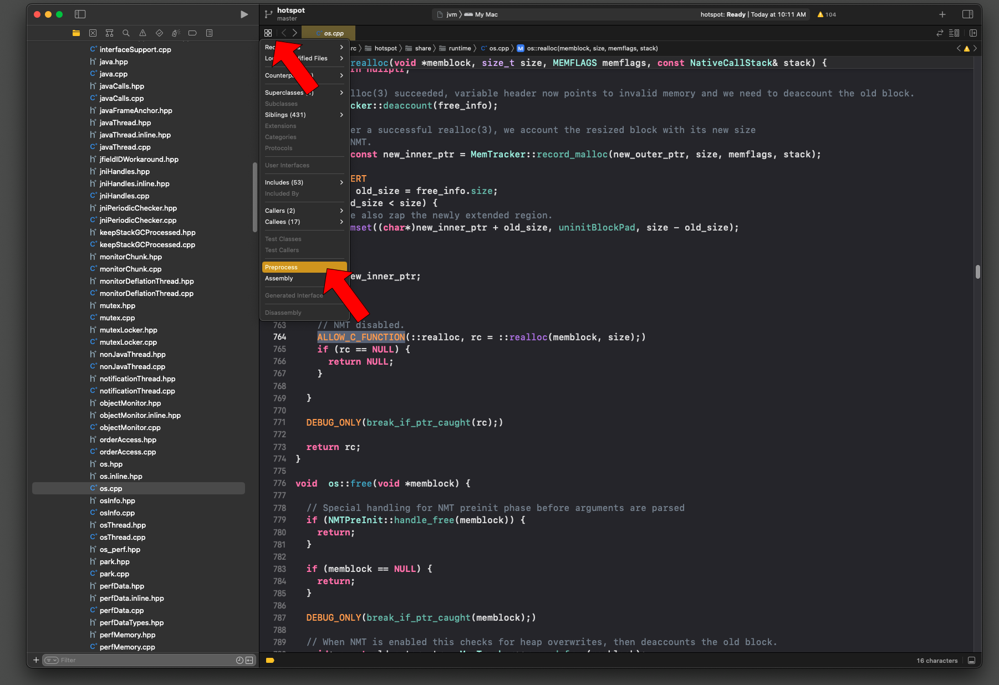
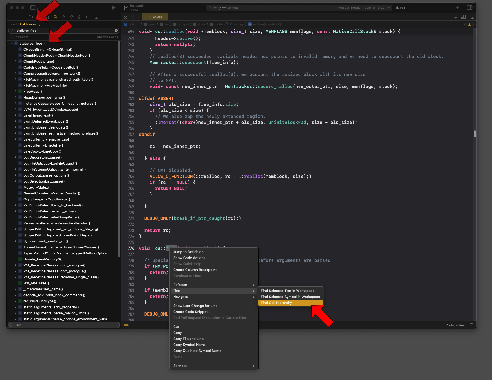

# Xcode project generator for building and running/debugging JDK VM hotspot

## Author:
gerard.ziemski@oracle.com

## Instructions:
Place the `xcode` folder inside openjdk `jdk` folder, 
`cd` into it and execute `run_clean.sh`

It will take a while to build hotspot VM first, 
it will then generate Xcode project in `build/xcode` folder,
which you can double click to open and use Xcode IDE to develop/debug/run java
and take an advantage of modern IDE features via UI.

## Examples:

To see how to turn on `UndefinedBehaviorSanitizer` in Xcode, please see `docs/README_UBSanitizer.md`

## Screenshots:

**generated Xcode project:**

**build using Xcode by clicking the `run` button 
(it will build then run preconfigured java process, i.e. `java --version`):**

**look up definitions:** 

**generate preprocessor output (or assembly):**

**find call hierarchy for a method:**

