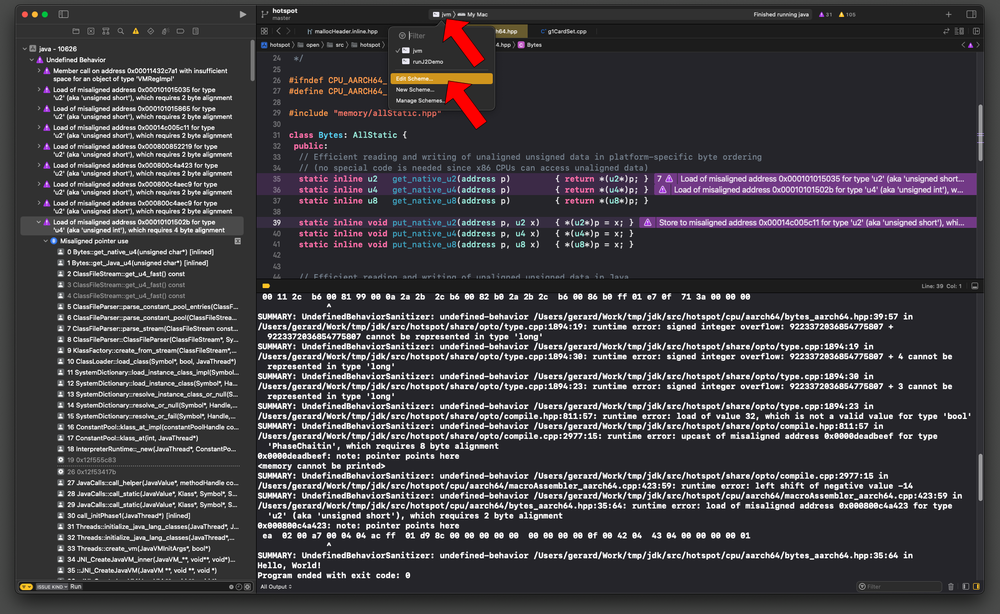
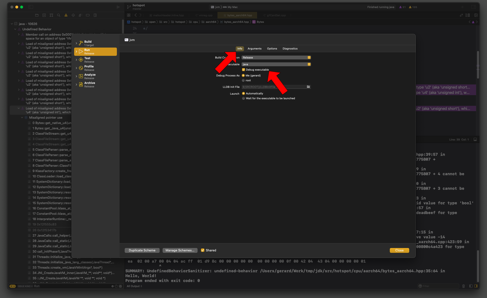
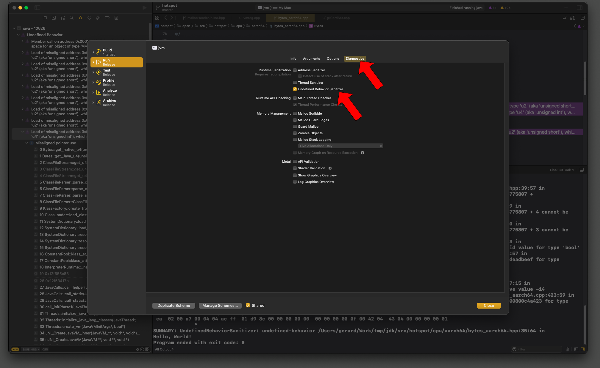

# Xcode UndefinedBehaviorSanitizer

## Background:
https://clang.llvm.org/docs/UndefinedBehaviorSanitizer.html

https://developer.apple.com/documentation/xcode/diagnosing-memory-thread-and-crash-issues-early

## Instructions on how to turn it ON in Xcode:

Click on selected runnable target **jvm**, then **Edit Scheme**:

Make sure debug mode in **Info** panel is ON (otherwise to get stack traces you will need to enable environment variable **UBSAN_OPTIONS=print_stacktrace=1**):

Turn ON **UndefinedBehaviorSanitizer** in **Diagnostics** panel:

Run the target by pressing the "play" button.
